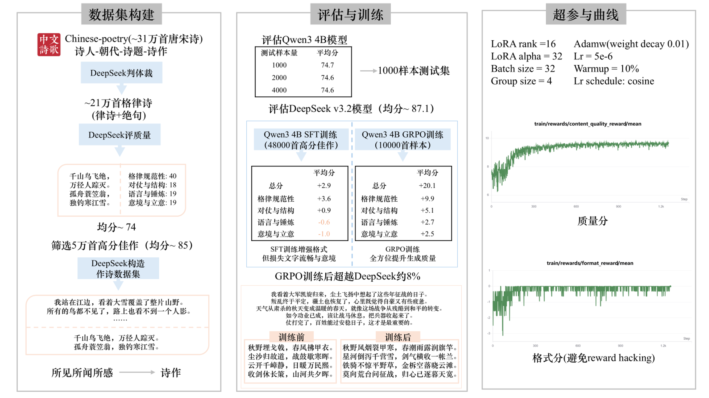

[**English**](README.md) · **中文**

# Singer · 格律诗垂类大模型

> **让 AI 学会写真正的诗** —— 不是堆砌辞藻，而是严守平仄、对仗工整、意境深远。

Singer 是一套面向**中国古典格律诗**（律诗、绝句）的完整训练与评测方案。以 [Qwen3-4B-Instruct](https://huggingface.co/unsloth/Qwen3-4B-Instruct-2507) 为基座，从数万首经典诗作中提炼规律，经 **SFT 监督微调** 与 **GRPO 强化学习** 两阶段打磨，最终产出能「依灵感成诗、合律成章」的垂类模型。

无论你是 NLP 研究者、诗词爱好者，还是希望在自己的应用中接入「会写诗的 AI」，Singer 提供从数据到模型、从训练到评测的**开箱即用**流水线。

---

<p align="center">
  
</p>

---

## 为什么选择 Singer？

| 能力 | 说明 |
|------|------|
| **格律优先** | 训练目标围绕《平水韵》平仄、押韵、对仗展开，而非泛泛的文本续写 |
| **四维专业评分** | 格律规范性（40）、对仗与结构（20）、语言与锤炼（20）、意境与立意（20），满分 100 |
| **灵感驱动创作** | 输入「所见所闻所感」，模型输出完整诗作 —— 贴近真实创作过程 |
| **完整闭环** | 数据清洗 → SFT → GRPO → 批量评测 → 日志分析，一步不缺 |
| **消费级 GPU 友好** | 内置 RTX 2080 Ti / RTX 4090 优化配置，4-bit LoRA 低显存训练 |
| **高质量语料** | 基于 [chinese-poetry](https://github.com/chinese-poetry/chinese-poetry) 开源项目中的全唐诗等经典语料构建，精选 **5 万首**，覆盖七律、五律、七绝、五绝。<br>📥 下载：[Chinese-Poetry-LLM](https://www.modelscope.ai/datasets/sudoplayer/Chinese-Poetry-LLM) @ ModelScope |

---

## 工作原理


**核心思路**：先用高质量诗作教会模型「怎么写」，再用 LLM 评委的打分信号（GRPO 奖励）引导模型「写得更准、更好」。

---

## 快速开始

### 1. 环境准备

需要 [uv](https://docs.astral.sh/uv/) 与 Python 3.11。依赖（含 CUDA 12.8 版 PyTorch）由 `pyproject.toml` / `uv.lock` 统一管理。

```bash
git clone <your-repo-url>
cd chinese-poetry-llm

# 安装 uv：https://docs.astral.sh/uv/getting-started/installation/
uv sync
```

运行脚本时使用 `uv run`（无需手动激活虚拟环境）；或在 `uv sync` 后激活 `.venv`，照常使用 `python`。

设置环境变量（可在 shell 或 `.env` 文件中配置）：

```bash
export DEEPSEEK_API_KEY="your-deepseek-api-key"      # 评分与 GRPO 奖励
export HUGGINGFACE_API_KEY="your-huggingface-token"  # 拉取基座模型
```

### 2. 准备数据

训练/评测 CSV 需包含两列：

- **`Spark`** — 创作灵感 / 心路历程（模型输入）
- **`Content`** — 诗作正文，每句一行（训练标签）

| 文件 | 用途 |
|------|------|
| `data/dataset_sft.csv` | SFT 训练集 |
| `data/dataset_grpo.csv` | GRPO 训练集 |
| `data/dataset_test.csv` | 评测集 |

仓库附带 [`data/sample.csv`](data/sample.csv) 示例。想快速试跑，复制三份即可：

```bash
cp data/sample.csv data/dataset_sft.csv
cp data/sample.csv data/dataset_grpo.csv
cp data/sample.csv data/dataset_test.csv
```

### 3. 一键训练与评测

在**项目根目录**执行：

```bash
# 阶段一：监督微调
uv run python sft/train_sft.py

# 阶段二：GRPO 强化学习（需 DeepSeek API）
uv run python grpo/train_GRPO.py

# 批量评测
uv run python eval/eval.py

# 分析评测日志（可视化得分分布等）
uv run python eval/log_analyzer.py
```

GRPO 训练产物默认写入 `grpo_outputs/`、`grpo_lora_adapters/`。

---

## 数据流水线

> 📥 **在 [ModelScope](https://www.modelscope.ai/datasets/sudoplayer/Chinese-Poetry-LLM) 下载精加工后的数据集** —— 包含 `Spark` 灵感字段与 `Content` 诗句字段的完整 CSV，附四维评分元数据。

从 [chinese-poetry](https://github.com/chinese-poetry/chinese-poetry) 开源项目中的原始古典诗词语料到可用训练集，按顺序执行 `dataset/` 目录下的脚本：

| 步骤 | 脚本 | 说明 |
|------|------|------|
| 1 | `1_convert.py` | 统一字段与编码 |
| 2 | `1_rough_genre.py` | 粗分类（诗体识别） |
| 3 | `2_strict_genre.py` | 精分类与过滤 |
| 4 | `3_score_and_spark.py` | LLM 四维评分 + 生成 `Spark` 灵感字段 |
| 5 | `4_analyze_and_select.py` | 按分数筛选、导出子集 |


**筛选参考**（基于 LLM 评分）：

| 阈值 | 规模 | 建议用途 |
|------|------|----------|
| 分数 ≥ 90 | 约 2,000+ 首（均分 ~92） | 精品子集，高质量 SFT |
| 分数 ≥ 85 | 约 34,000+ 首（均分 ~87） | 大规模训练 |

最终数据集体裁分布（5 万首精选集）：

| 体裁 | 数量 | 占比 |
|------|------|------|
| 七律 | 23,877 | 47.8% |
| 五律 | 14,317 | 28.6% |
| 七绝 | 10,323 | 20.7% |
| 五绝 | 1,483 | 3.0% |

详细统计见 [`dataset/analysis/genre_distribution.md`](dataset/analysis/genre_distribution.md)。

---

## 评分体系

[`poetry_core/poetry_evaluator.py`](poetry_core/poetry_evaluator.py) 调用 DeepSeek API，以格律诗专家视角打分：

| 维度 | 分值 | 考察要点 |
|------|------|----------|
| 格律规范性 | 40 | 平仄、押韵、句数、字数 |
| 对仗与结构 | 20 | 颔联/颈联对仗、起承转合 |
| 语言与锤炼 | 20 | 用词精准、诗眼、避免凑韵 |
| 意境与立意 | 20 | 意象统一、情感真切、立意深远 |

GRPO 阶段将**总分作为核心奖励信号**，并叠加格式奖励（句数、字数合规），让模型在「写得像诗」和「写得好诗」之间取得平衡。

---

## 项目结构

```
chinese-poetry-llm/
├── poetry_core/          # 共享核心：数据加载、生成、评分、日志
│   ├── poetry_data_loader.py
│   ├── poetry_generator.py
│   ├── poetry_evaluator.py
│   └── poetry_logger.py
├── dataset/              # 数据清洗流水线（1–5 步）
│   └── analysis/
├── sft/                  # 监督微调（Unsloth + LoRA）
├── grpo/                 # GRPO 强化学习（TRL + DeepSeek 奖励）
├── eval/                 # 批量评测与日志分析
├── data/                 # 数据目录（含 sample.csv 示例）
├── pyproject.toml        # 项目依赖（uv 管理）
└── uv.lock               # 锁定依赖版本
```

---

## 配置说明

各阶段配置文件独立，按需修改：

| 配置项 | 位置 | 说明 |
|--------|------|------|
| `GPU_FLAG` | `sft/sft_config.py`、`grpo/grpo_config.py`、`eval/eval_config.py` | `RTX2080Ti` / `RTX4090` / `DeepSeek`（仅 eval） |
| `MODEL_NAME` | 环境变量 | 默认 `unsloth/Qwen3-4B-Instruct-2507` |
| `IDX_START` / `IDX_END` | 各 config | 数据切片范围 |
| 数据路径 | 环境变量 | `SFT_DATA_PATH`、`GRPO_DATA_PATH`、`EVAL_DATA_PATH` |

2080 Ti 与 4090 的 batch size、混合精度、Flash Attention 等参数已预调优，切换 `GPU_FLAG` 即可。

---

## 创作示例

输入一段灵感（`Spark` 字段风格）：

> 我看着大军凯旋归来，尘土飞扬中想起了这些年征战的日子。叛乱终于平定，疆土也恢复了，心里既觉得自豪又有些疲惫。天气从肃杀的秋天变成温暖的春天，就像这场战争从残酷到和平的转变。如今功业已成，该让战马休息，把兵器收起来了。仗打完了，百姓能过安稳日子，这才是最重要的。

模型输出（每句一行，无标题无署名）：

```
秋野风烟裂甲寒，春潮雨露润旗竿。
星河倒泻千营雪，剑气横收一帐兰。
铁骑不惊平野草，金柝空落晓云滩。
莫向荒台问征战，归心已逐暮天宽。
```

---

## 技术栈

- **基座模型**：Qwen3-4B-Instruct（Unsloth 加速）
- **微调**：LoRA（rank 16）+ 4-bit 量化
- **强化学习**：TRL `GRPOTrainer`
- **奖励模型**：DeepSeek API 四维评分
- **实验追踪**：SwanLab（可选）

---

## 常见问题

**Q：没有 GPU 能跑吗？**  
评测阶段可将 `eval/eval_config.py` 中 `GPU_FLAG` 设为 `DeepSeek`，走 API 生成与评分；SFT / GRPO 仍需 CUDA GPU。

**Q：最低显存要求？**  
RTX 2080 Ti（22 GB）已在配置中验证，4-bit LoRA 可完成全流程。

**Q：必须用 DeepSeek 吗？**  
评分与 GRPO 奖励当前绑定 DeepSeek API；生成模块也支持本地模型推理，可自行替换 [`poetry_core`](poetry_core/) 中的 API 客户端。

---

## 许可证

MIT License

---

## 致谢

- 训练数据源自 [chinese-poetry](https://github.com/chinese-poetry/chinese-poetry) 开源项目 —— 感谢该项目的贡献者对中国古典诗歌数字化的长期坚持。
- 基座模型 [Qwen3-4B-Instruct](https://huggingface.co/unsloth/Qwen3-4B-Instruct-2507) 及 Unsloth 训练加速工具。

---

<p align="center">
  <strong>Singer</strong> — 古典格律，AI 新声<br>
  <sub>如果这个项目对你有帮助，欢迎 Star ⭐</sub>
</p>
